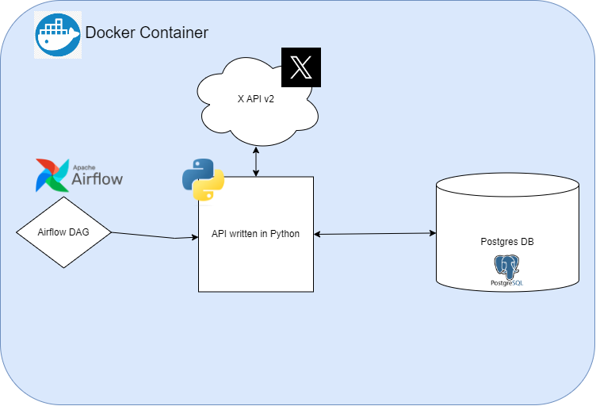

# x-tweet-grabber
A batch job processor for grabbing tweets of interest based on hashtags from X and posting them in a Postgres database.

## Architectural Overview

Base Intent: Wrap all functionality in a Docker Container. Every job works through an Airflow DAG which executes APIs in Python and communicates with the X API V2. Data is then ported to a Postgres database.

_Future functionality may increase as project develops over time._

## Components in Detail
_TODO: elaborate on each component as pieces are implemented_
- Airflow
- Internal Python API (better name TBD)
- Postgres DB
- Docker Container

## How to Run
_TODO_

## How to Use
_TODO_

## Testing & Validation
_TODO_